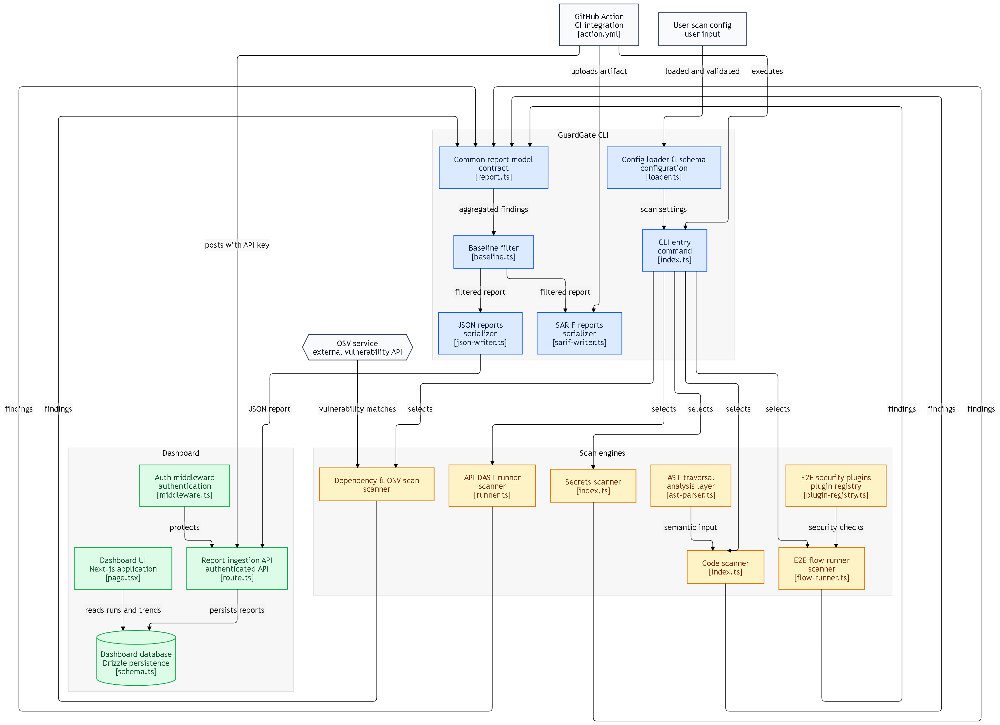

<div align="center">
  
  <h1>🛡️ GuardGate</h1>
  <p><strong>The Next-Generation Programmable Security Suite for Modern CI/CD Pipelines</strong></p>
  
  <p>
    <a href="https://guardgate.vercel.app">View Dashboard</a> •
    <a href="#features">Features</a> •
    <a href="#quick-start">Quick Start</a> •
    <a href="#agent-integration">AI Agent</a> •
    <a href="#contributing">Contributing</a>
  </p>
</div>

---

**GuardGate** is an extensible, AI-ready security suite designed to run seamlessly in your CI/CD pipelines. It goes beyond simple regex scanning by providing true semantic code analysis, headless browser E2E security tests, intelligent API fuzzing, and much more.



## ✨ Features

- **🌐 E2E Security Tests (Browser)**: Headless browser workflows powered by Playwright to catch XSS, CSRF, and Auth Bypasses using programmable YAML workflows.
- **⚡ API Fuzzer (DAST)**: Dynamically test your endpoints. Supports intelligent body-matching (`matchBody`/`notMatchBody`) to prevent false positives and accurately detect vulnerabilities like SQLi and IDOR.
- **🧠 True Semantic AST Analysis (Code Scanner)**: Ditch the regexes. Write real JavaScript plugins that traverse the TypeScript Compiler API (`ts.isCallExpression`, etc.) to find deeply embedded logic flaws.
- **📦 SBOM & Dependency Scanner**: Automatically audits your `package.json` against known CVEs.
- **🔑 Secrets Scanner**: Fast and reliable scanning to ensure credentials and tokens never make it into your repository.
- **📄 SARIF Output** *(v1.1.0)*: Generate [SARIF v2.1.0](https://sarifweb.azurewebsites.net/) reports that plug directly into GitHub's Security tab and GitLab's code-scanning UI — no custom dashboard needed.
- **🎯 Diff-Aware / Baseline Scanning** *(v1.2.0)*: Stop drowning in legacy security debt. Use `--baseline <commit>` to suppress pre-existing findings and only fail the build on *new* vulnerabilities introduced in your PR.
- **🤖 AI Agent Ready**: Out-of-the-box support for AI agents. Run `guardgate agent` to generate perfect workflow and rule schemas instantly.
- **📊 Vercel Hosted Dashboard**: View aggregated security reports, metrics, and evidence through a beautiful, Vercel-hosted React interface.

---

## 🚀 Quick Start

### Prerequisites
- [Node.js](https://nodejs.org/) (v18+)
- [pnpm](https://pnpm.io/) (v8+)
- [Git](https://git-scm.com/)

### 1. Installation

Clone the repository and install dependencies:
```bash
git clone https://github.com/Gmax-13/Guard-Gate.git
cd Guard-Gate
pnpm install
```

### 2. Building the Project

Build the CLI and the Dashboard packages:
```bash
pnpm build
```

*(This will recursively build `@guardgate/cli` and `@guardgate/dashboard`)*

### 3. Running the Scanners Locally

GuardGate is designed to run anywhere. To test it out locally using our example target, navigate to the `examples/` directory:

```bash
cd examples
guardgate scan
```
**Specific Modules:**
```bash
guardgate scan code    # Run Semantic AST analysis
guardgate scan api     # Run API DAST fuzzing
guardgate scan e2e     # Run Playwright Browser tests
guardgate scan sbom    # Run Dependency vulnerability scan
guardgate scan secrets # Run Secrets scan
```

**Output Formats:**
```bash
guardgate scan --format json       # JSON report only
guardgate scan --format console    # Console output only
guardgate scan --format both       # Console + JSON (default)
guardgate scan --format sarif      # SARIF v2.1.0 report only
guardgate scan --format all        # Console + JSON + SARIF
```

**Baseline Scanning (Diff-Aware):**
```bash
guardgate scan --baseline main     # Compare against main branch
guardgate scan --baseline HEAD~1   # Compare against previous commit
```

### 4. Running the Dashboard

The dashboard provides a visual interface for analyzing your JSON security reports. To run the development server locally:

```bash
pnpm --filter @guardgate/dashboard dev
```
Open [http://localhost:3000](http://localhost:3000) in your browser.

> **Note:** A production build of the dashboard is already hosted and available live on Vercel!

---

## 🔄 Continuous Integration (GitHub Actions)

GuardGate is designed to seamlessly integrate into your CI/CD pipelines. We provide an out-of-the-box GitHub Actions workflow that runs your full security suite and securely uploads the resulting report to your Vercel-hosted dashboard.

### Setup Instructions

1. **Configure your GitHub Secrets & Variables**
   Navigate to your repository's **Settings > Secrets and variables > Actions**:
   - Add a new **Secret** named `GUARDGATE_API_KEY`. (Generate this from your dashboard interface).
   - Add a new **Variable** named `GUARDGATE_DASHBOARD_URL`. (e.g., `https://guard-gate-dashboard-your-project.vercel.app`).

2. **Add the Workflow**
   Create a `.github/workflows/guardgate.yml` file in your repository:

```yaml
name: GuardGate Security Scan

on:
  push:
    branches: [ "main" ]
  pull_request:
    branches: [ "main" ]

jobs:
  security-scan:
    runs-on: ubuntu-latest
    steps:
      - name: Checkout Code
        uses: actions/checkout@v4

      - name: Install pnpm
        uses: pnpm/action-setup@v3
        with:
          version: 9

      - name: Setup Node.js
        uses: actions/setup-node@v4
        with:
          node-version: '20'
          cache: 'pnpm'

      - name: Install dependencies
        run: pnpm install --frozen-lockfile

      - name: Run GuardGate Scan
        run: pnpm exec guardgate scan --format all
        continue-on-error: true

      - name: Upload Report to Dashboard
        if: always()
        env:
          GUARDGATE_API_KEY: ${{ secrets.GUARDGATE_API_KEY }}
          GUARDGATE_DASHBOARD_URL: ${{ vars.GUARDGATE_DASHBOARD_URL }}
        run: |
          REPORT_FILE=$(ls -t .guardgate/guardgate-report-*.json 2>/dev/null | head -n 1)
          if [ -n "$REPORT_FILE" ] && [ -n "$GUARDGATE_API_KEY" ]; then
            curl -X POST "$GUARDGATE_DASHBOARD_URL/api/reports" \
              -H "Authorization: Bearer $GUARDGATE_API_KEY" \
              -H "Content-Type: application/json" \
              -d @"$REPORT_FILE"
          fi

      - name: Upload SARIF to GitHub Security
        if: always()
        uses: github/codeql-action/upload-sarif@v3
        with:
          sarif_file: .guardgate/
          category: guardgate-security-scan
        continue-on-error: true
```

> **💡 SARIF + GitHub Security Tab**: When using `--format all` or `--format sarif`, GuardGate generates SARIF v2.1.0 reports. The `upload-sarif` step above pushes findings directly into your repository's **Security → Code scanning alerts** tab — no custom dashboard required.

---

## 🤖 AI Agent Integration

GuardGate is built to be piloted by AI. We expose a powerful utility command that generates detailed YAML/JS instructions, empowering your AI coding assistant to automatically generate test cases and workflows tailored perfectly to your unique codebase.

Simply run:
```bash
guardgate agent
```
Provide the output to your AI, and watch it generate `.guardgate/flows` and `.guardgate/rules` dynamically!

---

## 🤝 Contributing

We welcome contributions from the community! To get started:

1. **Fork the repository** and clone your fork.
2. **Create a new branch**: `git checkout -b feature/my-awesome-feature`
3. **Make your changes**. Ensure you follow the existing code style.
4. **Test your changes**: Write new E2E or Unit tests if applicable, and run `pnpm test`.
5. **Commit your changes**: `git commit -m 'feat: add some awesome feature'`
6. **Push to the branch**: `git push origin feature/my-awesome-feature`
7. **Submit a Pull Request**.

### Repository Structure
- `packages/cli/`: The core GuardGate scanning engine and CLI.
- `packages/dashboard/`: The Next.js frontend for analyzing reports.
- `examples/`: Vulnerable applications and sample GuardGate configurations used for testing.

---

<div align="center">
  Built with ❤️ for secure software.
</div>
